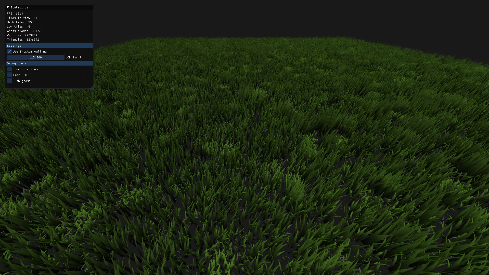

# grassrenderer

A simple grass renderer utilizing compute shaders and vertex manipulation to efficently render grass.



## Getting started

The project uses submodules so to clone properly clone the repository please use `--recurse-submodules`.
```
git clone --recurse-submodules git@github.com:Neathan/grassrenderer.git
```
```
git clone --recurse-submodules https://github.com/Neathan/grassrenderer.git
```

To build the project use cmake to generate build files appropriate for your system.
Example:
```
mkdir build
cd build
cmake ..
```

## Requirements

The code is tested on Windows using the MSVC compiler and OpenGL 4.6. The code is written for C++17 but is likely not required.
